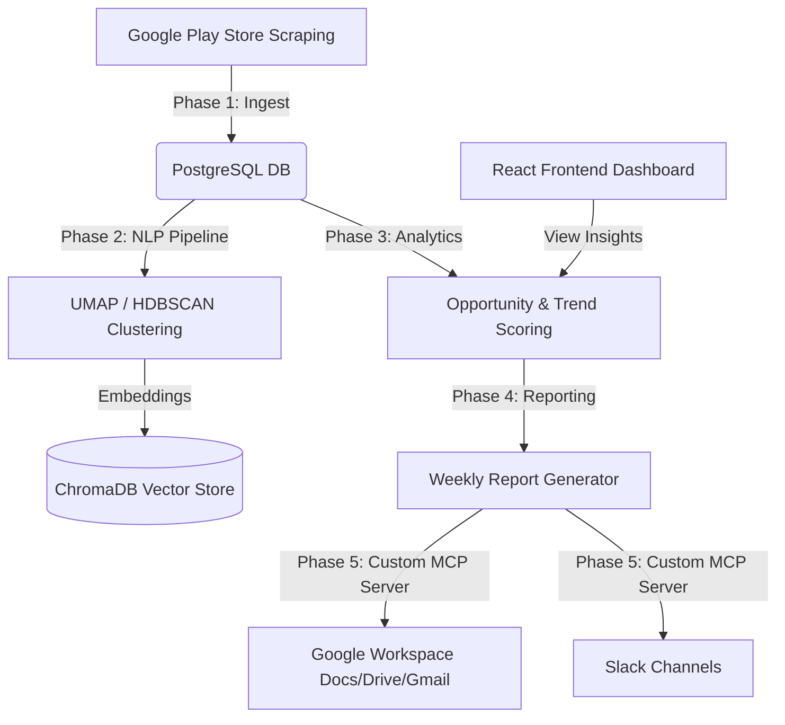

# Review Pulse: AI-Driven Customer Sentiment & Product Decision Engine

An enterprise-ready, full-stack microservices platform designed to ingest, process, and automatically deliver actionable product insights from user reviews.

---

## 🔗 Live Application
Experience the live dashboard interface here:
👉 **[Review Pulse Live Dashboard](https://review-pulse-eta.vercel.app)**

---

## 🔴 The Problem
Modern product teams are flooded with customer feedback from diverse channels: App Stores, Google Play, Support Tickets, Slack, and emails. Processing this unstructured text data manually creates major bottlenecks:
- **Data Fragmentation**: Feedback sits in siloed platforms (e.g. Play Store Console vs. Support Inbox), leaving teams without a single source of truth.
- **Analysis Latency**: Manually categorizing sentiment and extracting recurring themes takes days, leading to delayed responses to critical bugs or UX regressions.
- **Roadmap Guesswork**: Lacking quantitative metrics on feedback (like priority scores), PMs struggle to differentiate between vocal minority complaints and widespread product issues.

## ⚡ Why it Needs a Solution
In today's fast-paced software landscape, customer retention hinges on rapid iteration. Product teams need to transition from reactive bug-fixing to proactive feature planning:
- **Churn Reduction**: Unaddressed app crashes or UX friction directly drive down user ratings, leading to user churn.
- **Data-Driven Prioritization**: Teams need structured metrics—like Opportunity Scores—to back up roadmap decisions with empirical user sentiment data.
- **Workflow Automation**: Engineers and PMs shouldn't spend hours compiling weekly feedback reports or manually sharing verbatims. This pipeline must run autonomously.

## 🚀 Solution: What I Have Built
**Review Pulse** is a decoupled microservices system that automates the entire feedback lifecycle: from scraping and analysis to reporting and notifications.

### Key Features:
- **Multi-Source Ingestion Pipeline**: Autonomously scrapes and streams reviews from the Google Play Store (and App Store schemas) into a centralized database.
- **Unsupervised Theme Clustering**: Uses advanced NLP to cluster similar reviews (via UMAP dimension reduction and HDBSCAN clustering) to auto-extract core user issues without manual pre-tagging.
- **Sentiment Aggregation**: Generates precise sentiment polarity and confidence scoring for every feedback item.
- **Automated Opportunity Scoring**: Calculates business opportunity scores based on review volume, sentiment severity, and trend acceleration.
- **Custom Model Context Protocol (MCP) Server**: A dedicated OAuth-managed Google Workspace and Slack integration. It drafts emails, creates weekly doc summaries in Google Drive, and alerts teams via Slack when sentiment thresholds drop.
- **Premium Analytics Dashboard**: A sleek, modern dashboard providing executive snapshots, metric cards, sentiment trends, and recent customer signals.

---

## 🛠️ Solution: The Tech Stack & How I Built It
The application is architected as a decoupled, multi-phase pipeline built for scale and extensibility:

### 1. Microservices Architecture
- **Phase 1: Ingestion Service**: Standardizes raw scraping payloads into structured PostgreSQL schemas.
- **Phase 2: ML Processing Service**: Tokenizes, embeds, and clusters feedback using `sentence-transformers`, `scikit-learn`, `umap-learn`, and `hdbscan`.
- **Phase 3: Analytics Service**: Runs analytical aggregation queries, computing trends and Opportunity Scores.
- **Phase 4: Report Generation Service**: Compiles markdown-formatted executive reports on weekly trends.
- **Phase 5: Custom MCP Server**: Exposes a FastAPI JSON-RPC Model Context Protocol (MCP) server managing Google API authentication (OAuth 2.0) and Slack notifications.

### 2. Core Technologies Used
* **Frontend**: React (Vite) styled with Vanilla CSS, leveraging React Query for API caching.
* **Backend API Gateway**: FastAPI serving as the unified entry point.
* **Databases & Caching**: 
  - **PostgreSQL**: Relational storage for structured product records and reviews.
  - **ChromaDB**: High-performance local vector database storing review embeddings for semantic search.
  - **Redis**: Serves as the caching layer and Celery task broker.
* **ML Libraries**: scikit-learn, umap-learn, hdbscan, sentence-transformers.
* **CI/CD & Deployment**:
  - **Vercel** for hosting the React frontend.
  - **Render** for hosting containerized Python services (via Docker context).
  - **GitHub Actions** for linting, testing, and CI validation.
