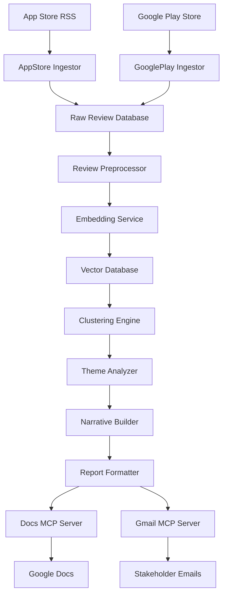

# Weekly Product Review Pulse - System Architecture

## Overview
An automated system that transforms public Google Play Store reviews into actionable weekly insight reports for Groww investment app, delivered through Google Workspace using MCP (Model Context Protocol).

## Key Requirements
- **Products**: Groww (focus product)
- **Data Sources**: Google Play Store (scraper) - Apple App Store disabled
- **Time Window**: Last 8 weeks (configurable)
- **Analysis**: Embeddings + density-based clustering + LLM insights
- **Delivery**: Google Workspace MCP servers (Docs + Gmail)
- **Output**: One-page narrative report with themes, quotes, and action ideas

## System Architecture

### 1. Data Ingestion Layer

#### 1.1 Google Play Review Collector (Primary Data Source)
```
Component: GooglePlayIngestor
- Source: Google Play Store (web scraping)
- Frequency: Daily incremental updates
- Storage: Raw reviews database
- Anti-scraping: Rotating proxies + user agents
```

**Technical Stack:**
- Python `scrapy` or `play-scraper`
- PostgreSQL for raw review storage
- Redis for caching and rate limiting
- Proxy rotation service
- Scheduled via Celery Beat

#### 1.2 App Store Review Collector (Disabled)
```
Component: AppStoreIngestor
- Status: DISABLED - Focus on Google Play Store only
- Source: iTunes Customer Reviews RSS feed (not used)
- Note: Can be enabled in future if needed
```

### 2. Data Processing Pipeline

#### 2.1 Review Preprocessor
```
Component: ReviewPreprocessor
- Text cleaning: Remove HTML, normalize whitespace
- Language detection: Filter non-English reviews
- Deduplication: Remove identical/similar reviews
- Metadata enrichment: Timestamp normalization, sentiment scoring
```

#### 2.2 Embedding Generation
```
Component: EmbeddingService
- Model: OpenAI text-embedding-3-small or sentence-transformers
- Batch processing: 1000 reviews per batch
- Storage: Vector database (Pinecone/Weaviate)
- Caching: Redis for frequently accessed embeddings
```

#### 2.3 Clustering Engine
```
Component: ClusteringEngine
- Dimensionality Reduction: UMAP
- Clustering Algorithm: HDBSCAN
- Parameters: min_cluster_size=5, min_samples=3
- Output: Cluster assignments + cluster metadata
```

#### 2.4 Theme Analysis
```
Component: ThemeAnalyzer
- LLM: GPT-4 for theme naming and insights
- Input: Cluster centroids + representative reviews
- Output: Theme names, descriptions, action ideas
- Validation: Ensure quotes appear in actual reviews
```

### 3. Report Generation Layer

#### 3.1 Narrative Builder
```
Component: NarrativeBuilder
- Template Engine: Jinja2 for report structure
- Content Selection: Top 5-7 themes by density
- Quote Selection: Representative verbatim quotes
- Action Ideas: LLM-generated actionable suggestions
- Validation: Cross-reference quotes with source reviews
```

#### 3.2 Report Formatter
```
Component: ReportFormatter
- Output Format: Google Docs compatible HTML/Markdown
- Layout: One-page optimized design
- Sections: Executive summary, themes, quotes, action ideas, impact analysis
- Branding: Consistent formatting and styling
```

### 4. Delivery Layer (MCP Integration)

#### 4.1 Google Docs MCP Server
```
Component: DocsMCPServer
- Protocol: Model Context Protocol
- Operations: Create document, insert content, format text
- Authentication: OAuth 2.0 with Google Workspace
- Error Handling: Retry on API failures, logging
```

#### 4.2 Gmail MCP Server
```
Component: GmailMCPServer
- Protocol: Model Context Protocol
- Operations: Compose email, attach report, send to stakeholders
- Template: Email body with report summary
- Recipients: Configurable stakeholder lists per product
```

### 5. Orchestration & Scheduling

#### 5.1 Workflow Orchestrator
```
Component: WorkflowOrchestrator
- Framework: Apache Airflow or Prefect
- Schedule: Weekly execution (configurable timing)
- Dependencies: Data ingestion → Processing → Analysis → Delivery
- Monitoring: DAG status, failure notifications
```

#### 5.2 Configuration Management
```
Component: ConfigManager
- Product configurations: App IDs, Play Store URLs
- Analysis parameters: Time windows, clustering thresholds
- Delivery settings: Stakeholder lists, report templates
- Environment variables: API keys, database credentials
```

## Data Flow Architecture



## Technology Stack

### Backend Services
- **Language**: Python 3.11+
- **Web Framework**: FastAPI for API endpoints
- **Task Queue**: Celery with Redis
- **Database**: PostgreSQL (relational) + Pinecone (vector)
- **Caching**: Redis
- **ML Libraries**: scikit-learn, umap-learn, hdbscan, sentence-transformers

### Infrastructure
- **Containerization**: Docker + Docker Compose
- **Orchestration**: Kubernetes (production) or Docker Compose (dev)
- **Monitoring**: Prometheus + Grafana
- **Logging**: ELK Stack (Elasticsearch, Logstash, Kibana)
- **CI/CD**: GitHub Actions

### External Services
- **LLM**: OpenAI GPT-4 API
- **Embeddings**: OpenAI text-embedding-3-small
- **Google Workspace**: Google APIs via MCP
- **Proxy Service**: Rotating proxy provider for scraping

## Security & Compliance

### Data Privacy
- **PII Redaction**: Automatic detection and removal of personal information
- **Data Retention**: Configurable retention policies (e.g., 6 months)
- **Access Control**: Role-based access to sensitive data

### API Security
- **Authentication**: OAuth 2.0 for Google Workspace
- **Rate Limiting**: Configurable limits for external APIs
- **Encryption**: TLS 1.3 for all external communications

## Deployment Architecture

### Development Environment
```
docker-compose.dev.yml
- Local PostgreSQL + Redis
- Mock MCP servers for testing
- Development FastAPI server
- Local file storage for testing
```

### Production Environment
```
Kubernetes Cluster
- 3x PostgreSQL replicas (primary + read replicas)
- Redis Cluster for caching
- Vector database (Pinecone managed service)
- Multiple service replicas for scalability
- Load balancer + ingress controller
```

## Monitoring & Observability

### Metrics Collection
- **Business Metrics**: Review count, processing time, report quality
- **Technical Metrics**: API response times, error rates, resource usage
- **ML Metrics**: Clustering quality, embedding similarity scores

### Alerting
- **Critical**: Data ingestion failures, MCP server downtime
- **Warning**: High processing latency, clustering quality degradation
- **Info**: Weekly report completion, system health checks

## Scalability Considerations

### Horizontal Scaling
- **Stateless Services**: Multiple replicas of preprocessing and analysis services
- **Database Sharding**: Partition reviews by product and time window
- **Vector Database**: Distributed indexing for large-scale embeddings

### Performance Optimization
- **Batch Processing**: Process reviews in configurable batch sizes
- **Caching Strategy**: Cache embeddings and cluster results
- **Incremental Updates**: Only process new/changed reviews weekly

## Error Handling & Recovery

### Failure Scenarios
- **API Failures**: Retry with exponential backoff, fallback to cached data
- **Clustering Failures**: Fallback to simpler keyword-based analysis
- **MCP Failures**: Queue reports for retry, notify administrators

### Data Validation
- **Input Validation**: Ensure review data quality and format
- **Output Validation**: Verify report completeness and accuracy
- **Cross-validation**: Compare themes across weeks for consistency

## Configuration Management

### Environment-Specific Configs
```yaml
# config/production.yaml
products:
  - name: "INDMoney"
    app_store_id: "123456789"
    play_store_url: "https://play.google.com/store/apps/details?id=com.indmoney"
  # ... other products

analysis:
  time_window_weeks: 10
  min_cluster_size: 5
  max_themes: 7

delivery:
  stakeholders:
    INDMoney: ["product-team@company.com", "leadership@company.com"]
  schedule: "friday 09:00"
```

This architecture provides a robust, scalable foundation for the Weekly Product Review Pulse system, ensuring reliable data ingestion, intelligent analysis, and seamless delivery through Google Workspace MCP integration.
